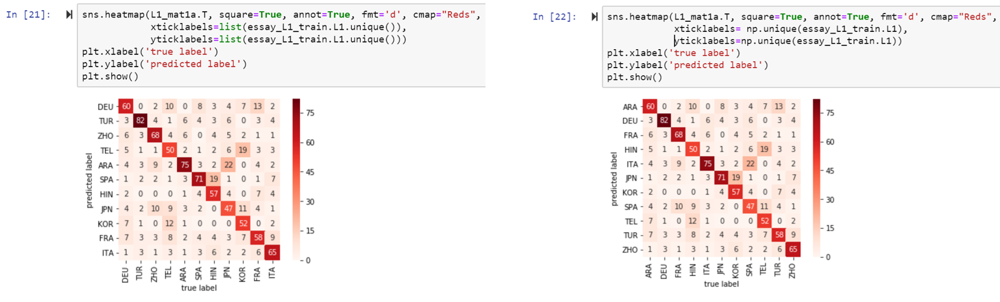
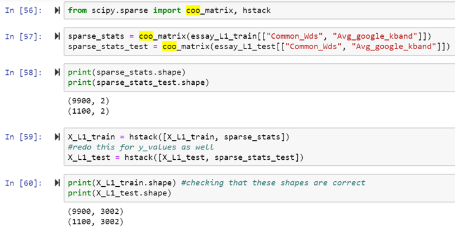

# Useful Code
### Here we'll add some useful snippets of code that you can use to help format your code!

* #### Getting multiple units of output from a block of code:
	- *Just two lines of code!*

    ```
    from IPython.core.interactiveshell import InteractiveShell

    InteractiveShell.ast_node_interactivity = "all"
    ```

	- *Put this in a block at the top of your notebook, and all subsequent blocks can output multiple things!*
	- *For more info, look [here](https://stackoverflow.com/questions/34398054/ipython-notebook-cell-multiple-outputs)*

* #### Uh-oh! What's the encoding of this file?!?!
	- *Go to command line*
	- *Type:* file \<filenamehere\>
	- *This will show you the encoding of the file!*
	- *Still doesn't work? Google is your friend!!*

### HW-3 Hints
* When using a heatmap, you need to make sure your labels line up with 
the correct entries in the matrix. For this to work, you need to make 
sure your x and y labels are sorted. Compare the two outputs below. The 
one of the left doesn't sort, but the np.unique() function on the right 
hand side does sort the data.


* Want to see what happens when you combine text with other features 
like k-bands or TTR? Make sure you convert the text to vectors FIRST, 
and then combine. To do this, you'll need to convert your numerical data 
into sparse matrices (I know, seems kind of redundant, and there are 
other methods besides the one I've shown to accomplish this--please 
explore!). I use coo_matrix and hstack. Essentially, coo_matrix does the 
conversion and hstack does the combination. Note: X_L1_train and 
X_L1_test are my previously transformed Text vectors.
 
